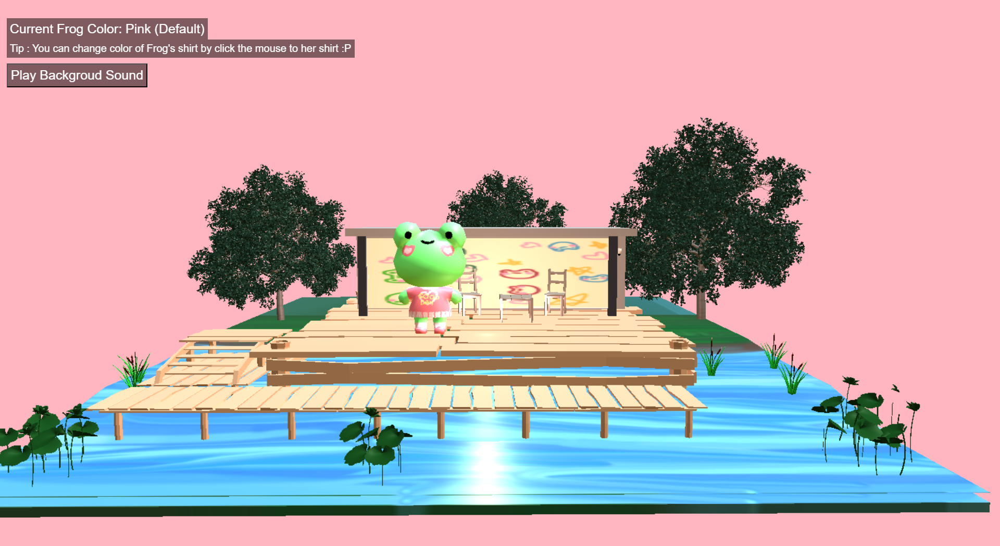
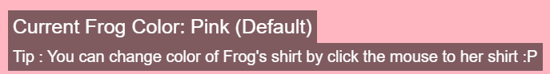
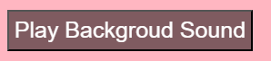

# CS299 1/66 - Term Project - Froggy

## What this Project do ?
&nbsp;&nbsp;&nbsp;&nbsp;This project is a 3D model viewer that utilizes Three.js, a popular JavaScript library for creating and displaying animated 3D computer graphics in a web browser.  
&nbsp;&nbsp;&nbsp;&nbsp;This project specifically focuses on displaying Frog models in the .gltf format. It also provides user interactives , It also provides interactive features that allow users to manipulate the 3D model in various ways.

## Tech Use
- Blender 3.6  
For 3D Modelling
- Three.JS
- VS Code

## Feature
### Status Text
- Provide status of current colour of Frog's shirt

### Shader & Lightning
- Using Directional Light and Point Light
- Using MeshPhongMaterials

### Backgroud Sound & Effect Sound
- User can Play/Pause Backgroud Sound by pressing a button in top left corner

- When user change the Frog's shirt . Will play the change cloth sound
### Interactions
1. Rotation: Users can click and drag to rotate the 3D model, providing a 360-degree view of the object.
2. Zoom: By using the scroll wheel, users can zoom in for a closer look or zoom out to see the model in a broader context.
3. Panning: Users can shift the model horizontally or vertically within the viewer.
4. Selection: Users able to change a part of model by using mouse picking. In this project user can change the Frog's shirt by clicking her shirt.

## Dependencies
- Python 3.6
- Web Browser with Internet Connection
## How to run the project
1. Clone the project
```git
git clone https://github.com/pakin6509681182/cs299-term-project-66.git  
```
2. Open Terminal(Mac) or Command Prompt(Windows) and change directory to the project folder
3. Run the following command
    ```python
    python -m http.server
    ```
    Or use can use any other method to run a local server  
4. Open your web browser and go to http://localhost:8000/  
5. Open CS299_TermProject_Frog.html  
6. Enjoy the Froggy